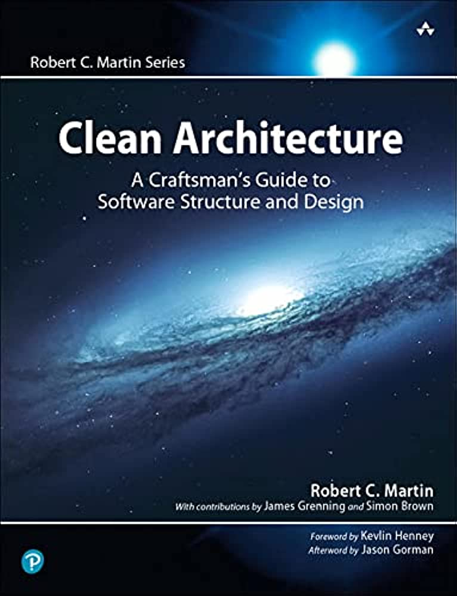

# Clean Architecture  Robert C. Martin 

I find this book lacking in sketches which alienates some readers or as Robert C. Martin calls them "Modern Developers". While it explains important topics that not only target software architects but also developers that implement the architect's vision, as the author mentioned in various chapters i.e. 
- "The bigger lie that developers buy into is the notion that writing messy code makes them go fast in the short term, and just slows them down in the long term"
- "Remember, as a software developer, you are a stakeholder. You have a stake in the software that you need to safeguard. That’s part of your role, and part of your duty. And it’s a big part of why you were hired"
- etc...

# Contents
    ✅ Finished
    ❌ Unfinished
    🖥️ Computerized
    📃 Uncomputerized
## [Chapter 1 - What Is Design and Architecture](./Chapter%201%20-%20What%20Is%20Design%20and%20Architecture/README.md) ✅🖥️
## [Chapter 2 - A Tale of Two Values](./Chapter%202%20-%20A%20Tale%20of%20Two%20Values/README.md) ✅📃
## [Chapter 3 - Paradigm Overview](./Chapter%203%20-%20Paradigm%20Overview/README.md) ❌📃
## [Chapter 4 - Structured Programming](./Chapter%204%20-%20Structured%20Programming/README.md) ❌
## [Chapter 5 - Object-Oriented Programming](./Chapter%205%20-%20Object-Oriented%20Programming/README.md) ❌📃
## [Chapter 6 - Functional Programming](./Chapter%206%20-%20Functional%20Programming/README.md) ❌📃
## [Chapter 7 - SRP The Single Responsibility Principle](./Chapter%207%20-%20SRP%20The%20Single%20Responsibility%20Principle/README.md) ❌
## [Chapter 8 - OCP The Open-Closed Principle](./Chapter%208%20-%20OCP%20The%20Open-Closed%20Principle/README.md) ❌
## [Chapter 9 - LSP The Liskov Substitution Principle](./Chapter%209%20-%20LSP%20The%20Liskov%20Substitution%20Principle/README.md) ❌
## [Chapter 10 - ISP The Interface Segregation Principle](./Chapter%2010%20-%20ISP%20The%20Interface%20Segregation%20Principle/README.md) ❌
## [Chapter 11 - DIP The Dependency Inversion Principle](./Chapter%2011%20-%20DIP%20The%20Dependency%20Inversion%20Principle/README.md) ❌
## [Chapter 12 - Components](./Chapter%2012%20-%20Components/README.md) ❌
## [Chapter 13 - Component Cohesion](./Chapter%2013%20-%20Component%20Cohesion/README.md) ❌📃
## [Chapter 14 - Component Coupling](./Chapter%2014%20-%20Component%20Coupling/README.md) ❌