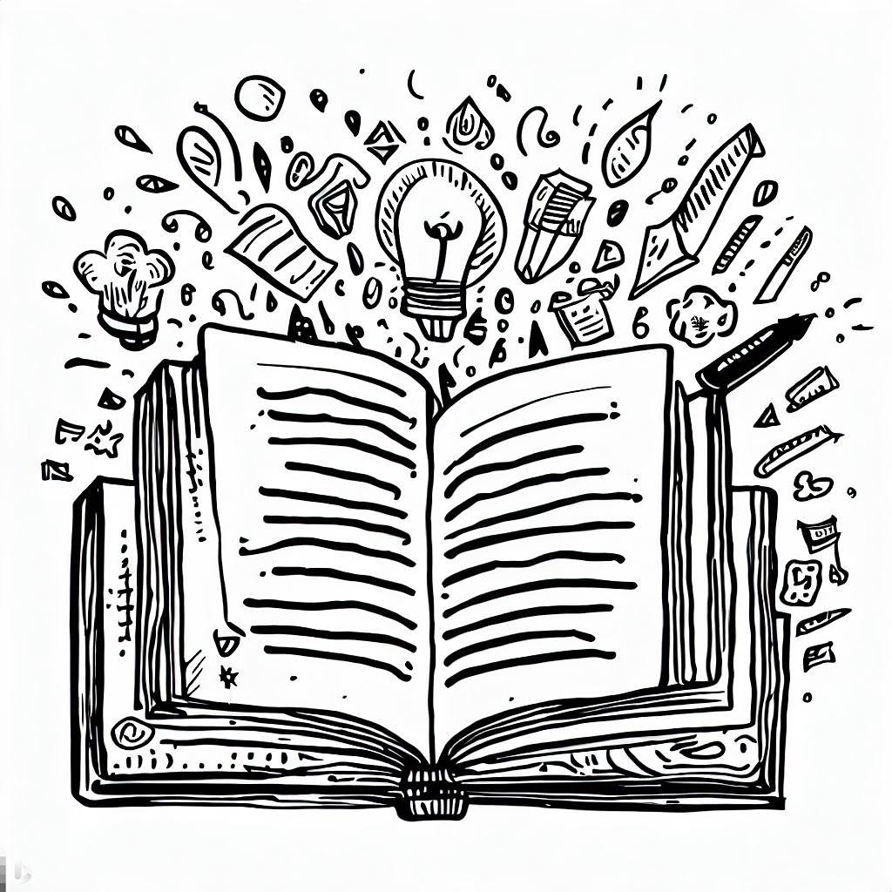

# sketch-a-book
Here you will find my sketchnotes of computer science books that I read.

These sketchnotes are no substitute for books' contents, but they help clarify the author's take-home message from each chapter -at least from my point of view-.

# Books
## [Clean Architecture](./Clean%20Architecture/README.md)  Robert C. Martin 

# Feedback
I decided to share these sketchnotes in case they could positively impact someone’s learning journey, even slightly. They are the result of my efforts to summarize and visualize the key points of the listed books that I found interesting and useful and especially, controversial. Input and comments on how to enhance these sketchnotes are very welcomed. If you notice any mistakes or inaccuracies, please don’t hesitate to fork this repository and make a pull request with your fixes.